:width100: width='100%'
:width80: width='80%'
:width50: width='50%'
:icons: font
:source-highlighter: highlightjs

# 简介

本项目是一个基于 org.wsp.framework 基础框架的开发模板，通过该模板可以快速搭建应用开发环境。

# 框架的目标
1. 采用开发人员较为熟悉的框架
2. 采用插件模式组织各功能模块
3. 支持多种数据库
4. 提供方便安装、部署、演示环境
5. 显著减少代码开发量

# 采用的主要技术列表
* 基础框架: springboot
* 数据库连接池: HikariCP
* 数据库元数据管理(表结构管理): Liquibase, SchemacCrawler
* ORM: Hibernate, SpringData JPA, QueryDSL, Spring JdbcTemplate
* 工作流引擎: Flowable
* 批处理框架: Spring Batch
* 计划任务调度框架: Spring, Quartz
* 页面模板引擎: Thymeleaf
* 前端 JS 框架: Bootstrap, Smartclient, Echars
* 文档编写工具: Asciidoc (Asciidoctor)
* 权限管理框架: Spring Secuirty
* WebService 框架: CXF
* 开发环境: Eclipse, Git, Gradle, Sonatype Nexus, Docker

# 开发环境要求(软件)
|===
| 软件名称		| 版本			| 说明
| JDK           | 1.8 +			|
| git           | 2.18.0 +		| 源代码版本管理软件
| eclipse       | Oxygen.3a + 	|
| gradle        | 4.8.1 + 		| 构建工具
|===

# 快速开始体验
1. 安装 JDK,版本需要 1.8及其以上, 注意需要 JDK，不是 JRE，且版本需要 1.8及其以上。

2. 编辑 C:\Windows\System32\drivers\etc\hosts 文件
+
--
打开 hosts 文件

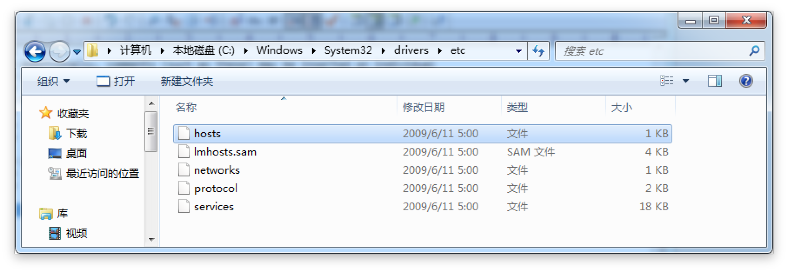

添加一条域名和IP的映射: 116.228.4.126  developer.gbicc.net (下图蓝色部分)

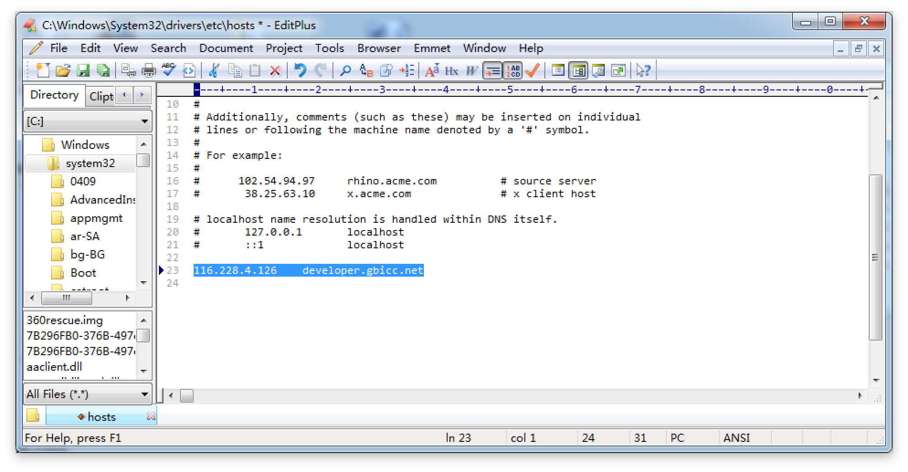

保存, 由于 hosts 文件是系统文件,需要以管理员身份运行文本编辑器进行修改。

打开控制台,执行 ping developer.gbicc.net 命令,如果能够 ping 通,代表操作成功。

image::resources/images/windows/hosts-003.png[{width50}]
--
3. 安装 git 源代码版本管理软件客户端
+
--
从 https://git-scm.com/download/win 下载 git for windows 软件

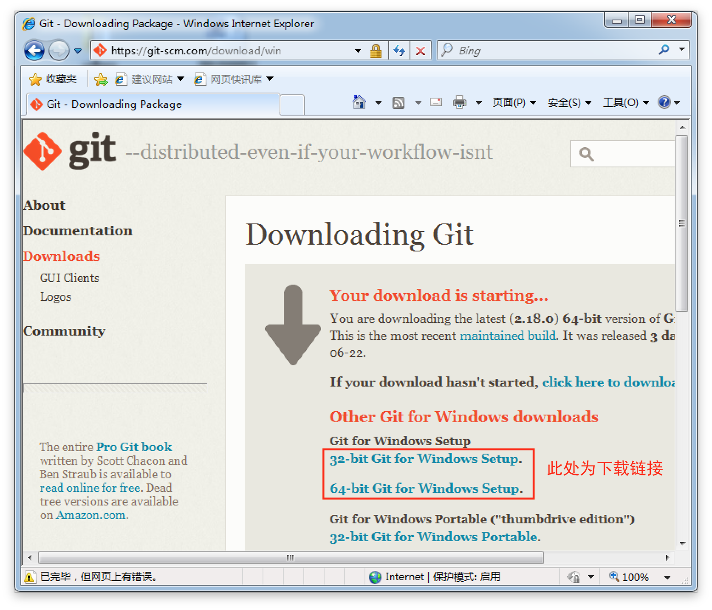

启动上述下载的安装程序，开始安装，在安装过程中所有选项均为默认值，直到安装完毕。

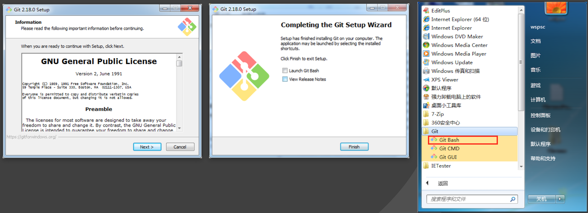

启动 git bash,执行 git --version 命令查看是否安装成功

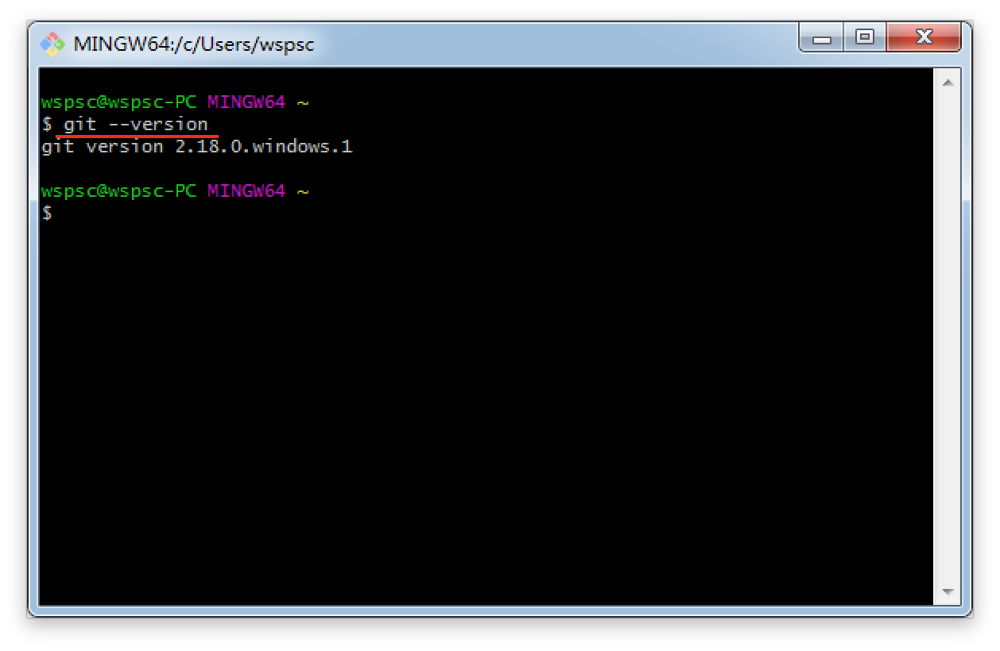

TIP: 注意: 此 git bash 终端不同于 windows 自带的 cmd 控制台, 该终端是 MinGW (inimalist GNU for Windows),其命令非常类似 linux,
如未特殊说明,以下所有命令操作均基于此终端进行。
--

4. 安装 gradle 构建工具
+
--
从 https://gradle.org/releases 下载 gradle 软件

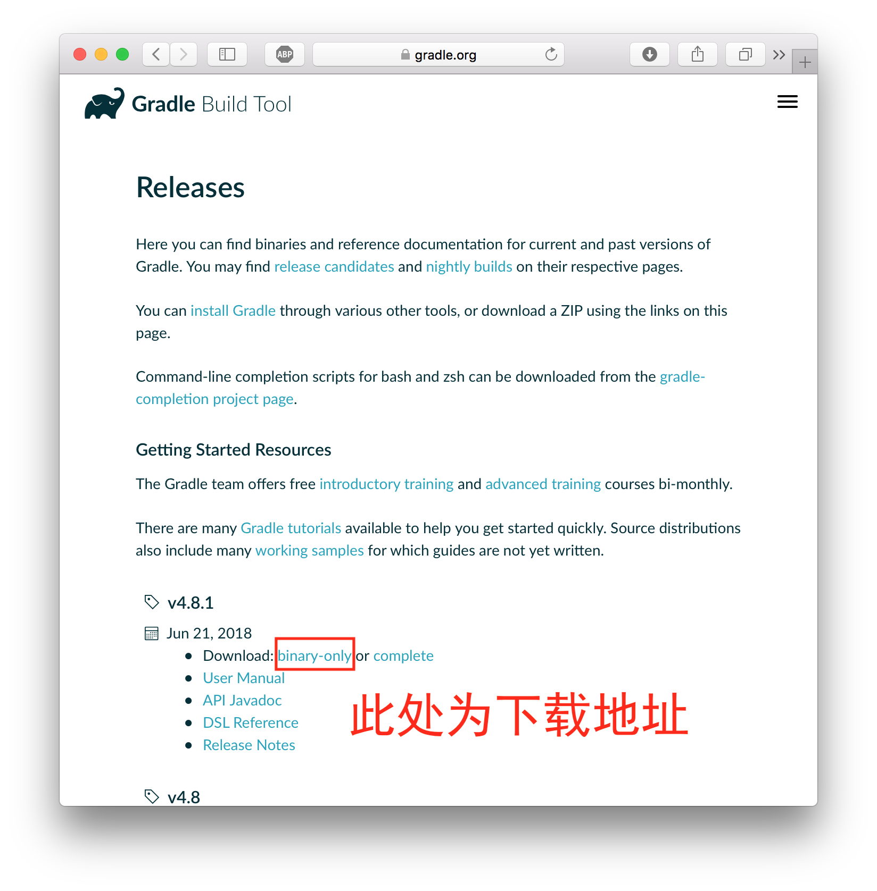

解压缩上面下载的 gradle-4.8.1-bin.zip 文件,例如解压到 c:\wspsc\tools\gradle-4.8.1 目录

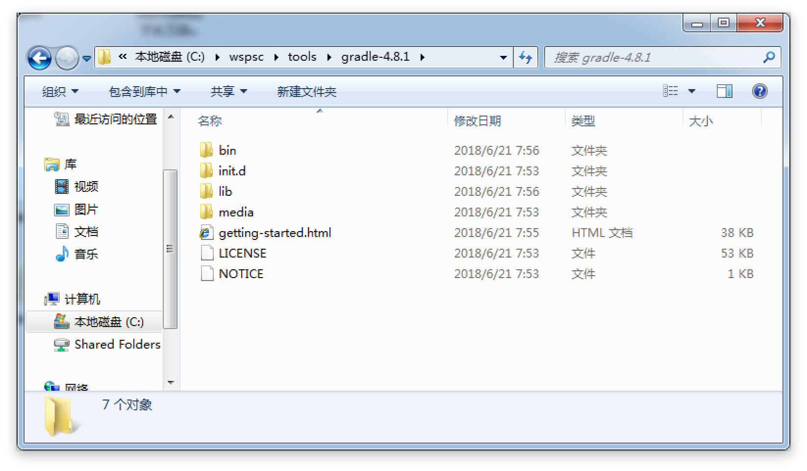

添加 PATH 环境变量

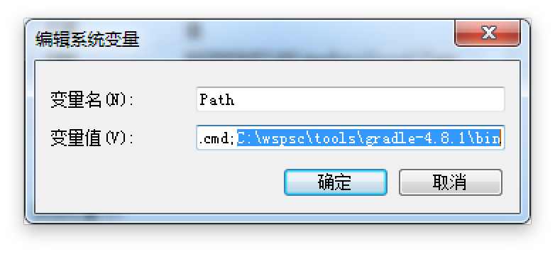

测试安装是否成功

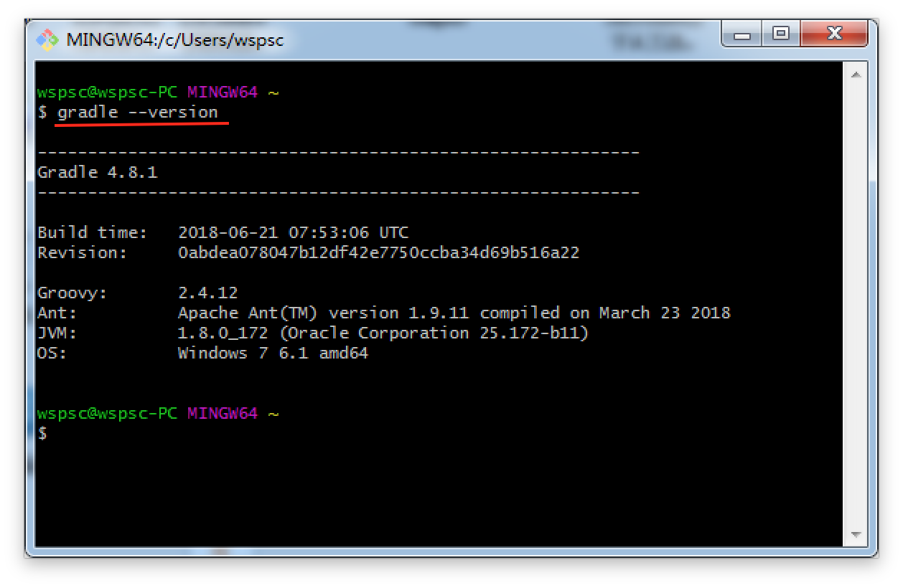
--
5. 准备工作空间目录
+
--
为了便于操作,假设以下所有操作都在 c:\wspsc\workspace 工作空间目录中进行，如果目录不存在,请自行创建。
--

6. 下载脚手架工程源代码
+
TIP: 再次提醒: 以下所有命令均在 git bash 终端中执行(该终端提供一个类似 linux 终端的操作模式), 欲在 windows 自带的 cmd 控制台中执行,请自行转换。
+
--
----
# 如果工作空间目录不存在，创建工作空间目录
mkdir /c/wspsc/workspace

# 将当前目录切换到工作空间目录
cd /c/wspsc/workspace

# 下载脚手架工程源代码,下载到 c:/wspsc/workspace/application 目录中,
# 如果 “克隆的目标目录” 参数未指定,则默认下载到 c:/wspsc/workspace/framework-project-scaffold 目录
git clone http://developer.gbicc.net:9000/wangshaoping/framework-project-scaffold.git application
          --------------------------------------------------------------------------- -----------
          源代码 git URL                                                               克隆的目标目录
----

操作过程如下:

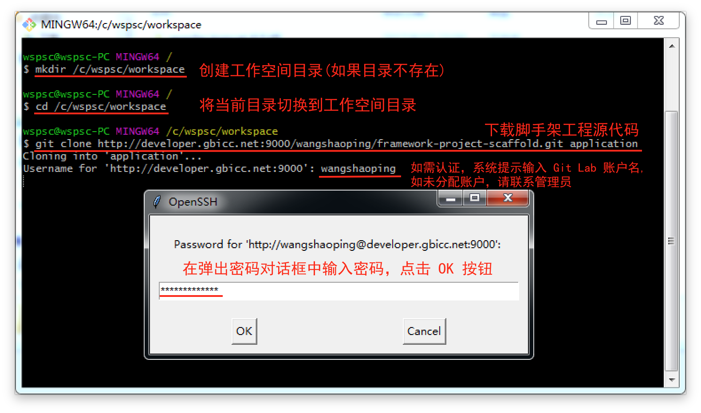

输入的账户名和密码通过验证后, 开始下载脚手架工程源代码

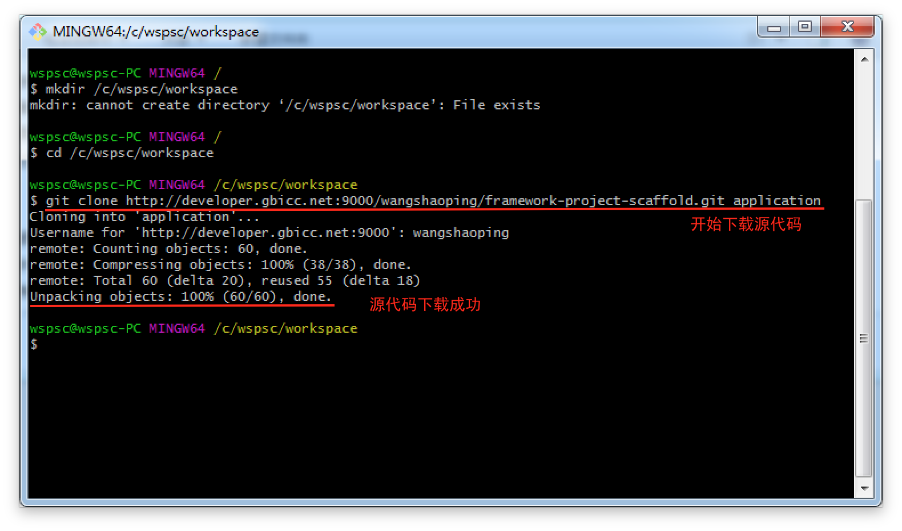

当脚手架工程源代码下载成功后，目录结构大概如下:

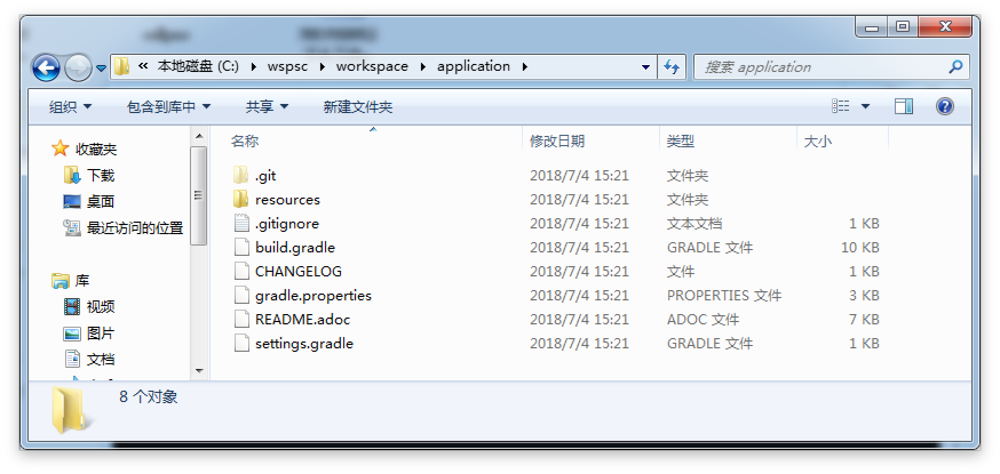
--
7. 创建应用
+
--
----
# 进入脚手架工程目录
cd /c/wspsc/workspace/application
	
# 创建应用工程
# --group 选项(可选项): 指定创建的工程的组,如未设置,采用默认值: net.gbicc
# --name  选项(必选项): 指定创建的工程的名称
# 请自行根据项目需要设置 --name 选项, 为便于说明, 此处采用 net.gbicc.app 作为项目名称
gradle createApp --group=net.gbicc --name=net.gbicc.app

# 等待执行完毕
----
操作过程如下:

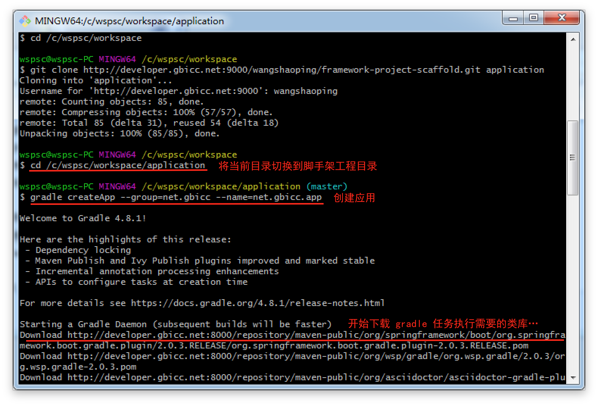

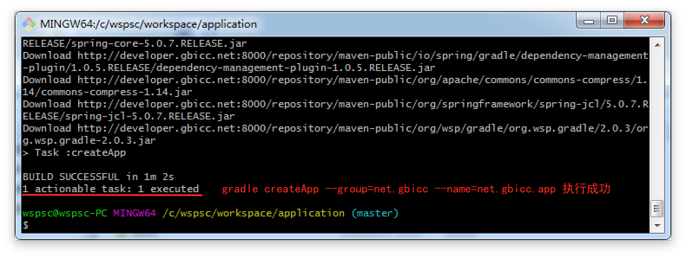

此时 application 目录内容如下:

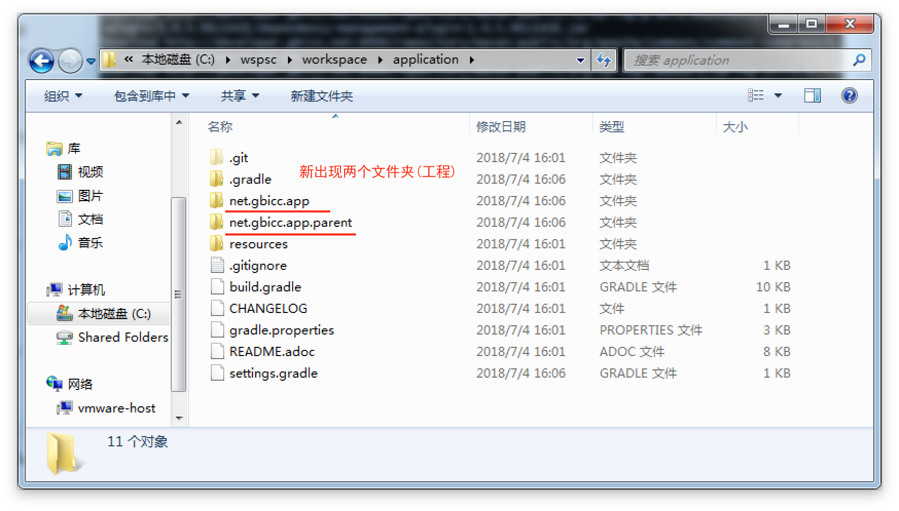
--
8. 构建应用
+
--
----
# 进入脚手架工程目录
cd /c/wspsc/workspace/application

# 构建 war
gradle bootWar
	
# 等待执行完毕，可能需要等待较长时间，具体时间依赖于网速。
----
操作过程如下:

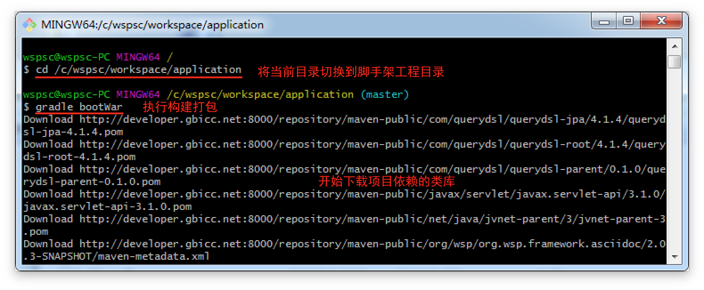

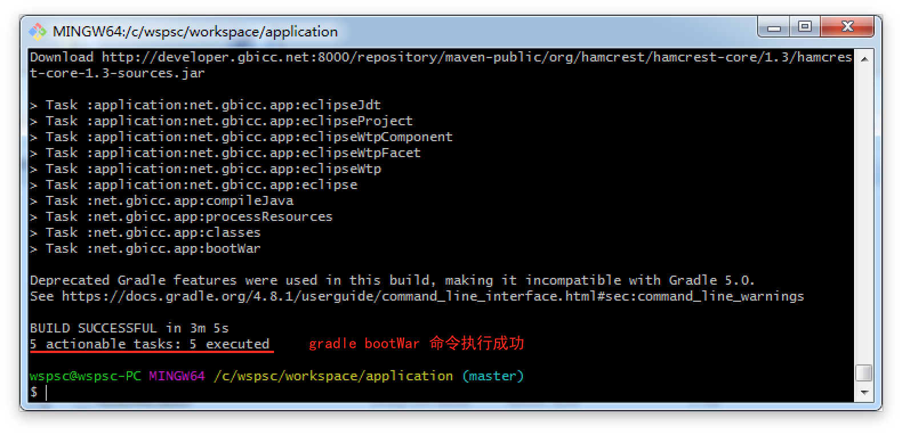

构建完毕后，目录结构如下:

image::resources/images/windows/app-006.png[{width50}]
--
9. 启动系统
+
--
----
# 进入应用目录
cd /c/wspsc/workspace/application/net.gbicc.app/build/libs

# 启动应用, 也可采用 java -jar net.gbicc.app-2.0.3-SNAPSHOT.war 命令执行
./net.gbicc.app-2.0.3-SNAPSHOT.war

# 请等待一定时间，让应用启动完毕。
# 应用默认会在 8080 端口提供服务,如果启动过程中出现端口冲突错误，请按 ctrl+c 组合键停止应用，
# 打开 c:\wspsc\workspace\application\net.gbicc.app\build\libs\config\application.properties 文件，
# 修改 server.port=8080 配置项,将 8080 端口修改为其他未被占用的端口号
# 再次回到 c:\wspsc\workspace\application\net.gbicc.app\build\libs 目录，重新启动应用。
----
操作过程如下:

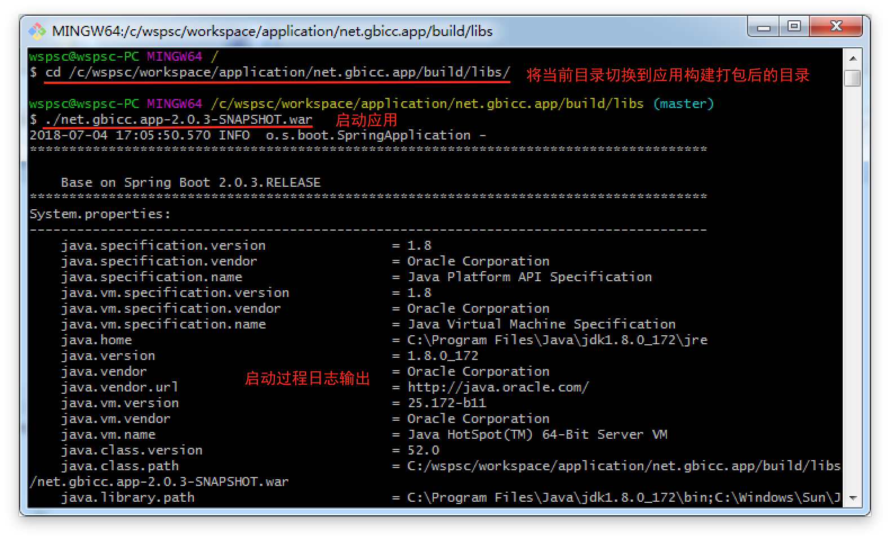

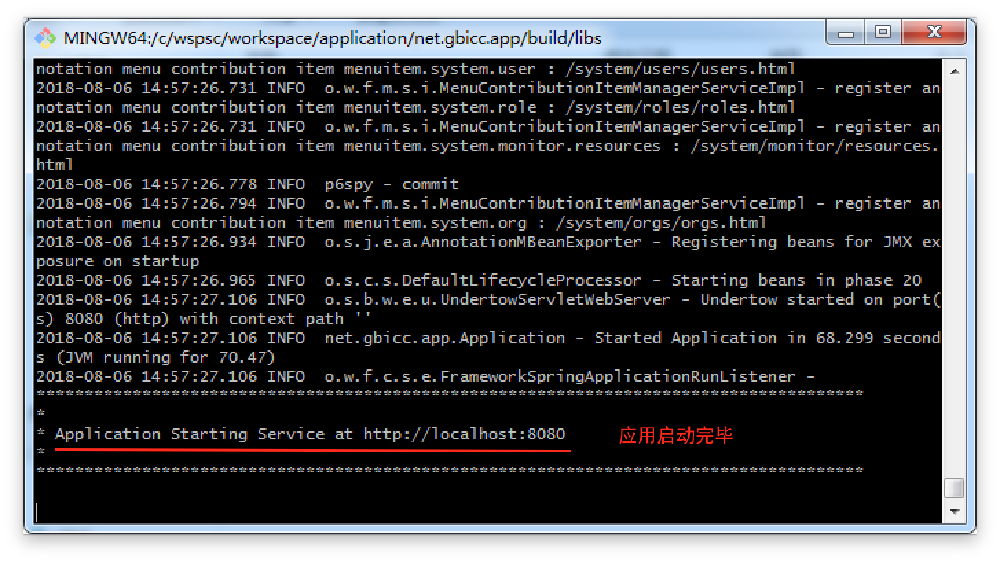
--

10. 开始使用系统
+
--
打开浏览器，访问 http://localhost:8080 (如果端口号被修改过，请将 8080 替换为修改后的端口号,以下示例采用 8088 端口), 由于系统是首次运行,需要进行必要的初始化操作,系统会自动进入安装界面。


点击 “快速安装” 按钮，进行安装。


image::resources/images/windows/install-003.png[{width50}]

安装完毕后，点击 “开始使用系统” 按钮，进入登录页面。

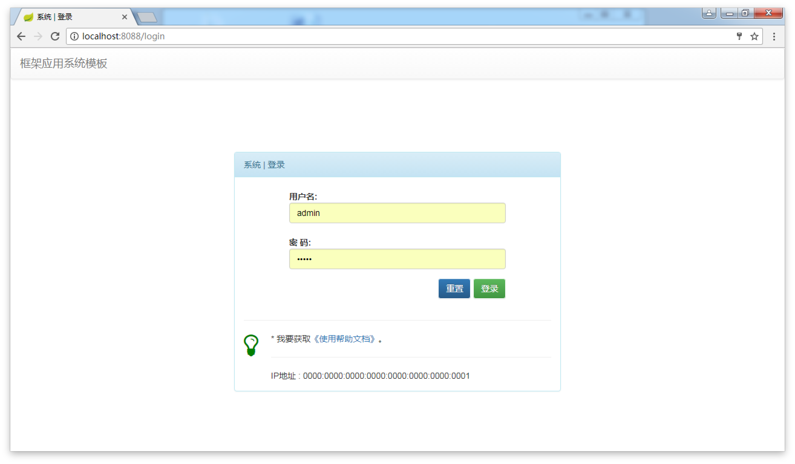

默认管理员用户名/密码: admin/admin, 登录成功后进入主页面。

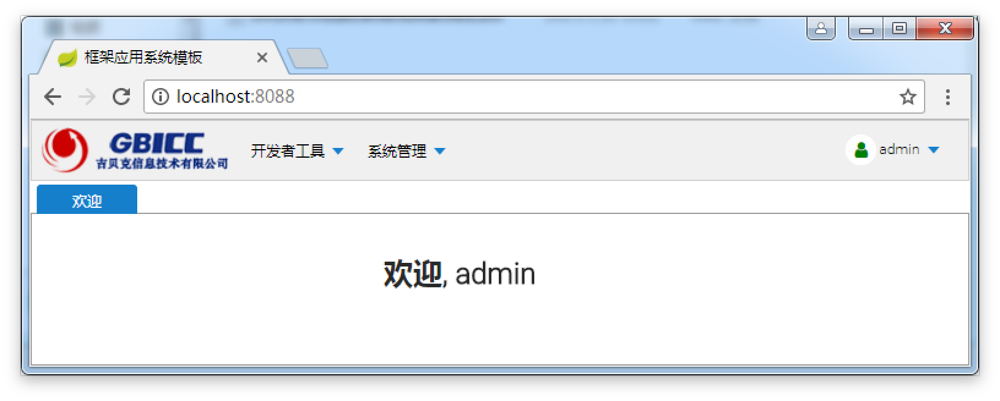
--

# 搭建开发环境
1. 生成 eclipse 项目
+
--
```shell
# 进入项目目录
cd /c/wspsc/workspace/application
     
# 生成 eclipse 工程
gradle eclipse
```
--

2. 将所有工程导入到 eclipse 中

3. 在 eclipse 运行
+
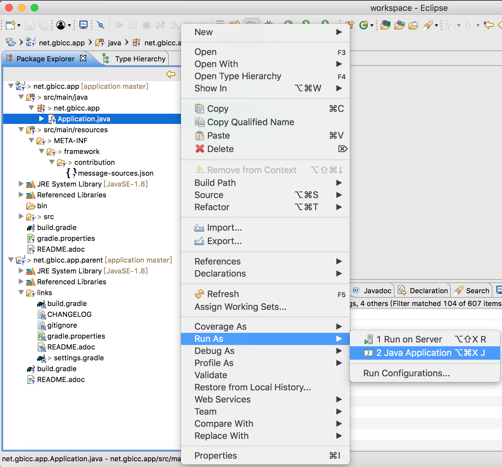


4. eclipse 中配置 jrebel
+
--
配置 jrebel 可以避免修改源码后的重启，显著提高开发效率, 在 eclipse 配置方法如下:

在 eclipse 的 Run Configurations 中配置 VM 参数 

```shell
-agentpath:/Users/wangshaoping/wspsc/developer/tools/jrebel/jrebel_2018.1.1.agent/lib/libjrebel64.dylib
```
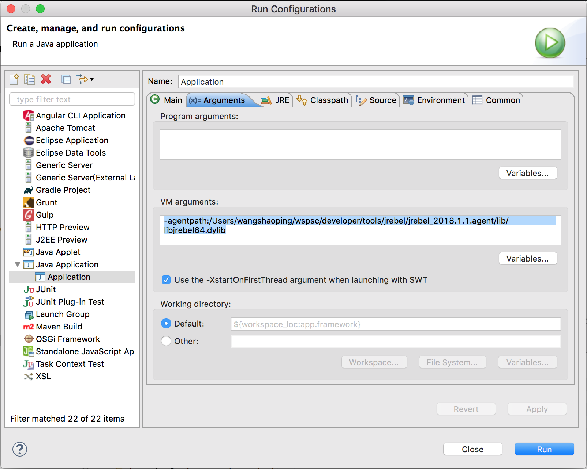
--

# 查看帮助文档
本框架系统自带帮助文档，可通过以下方式访问:

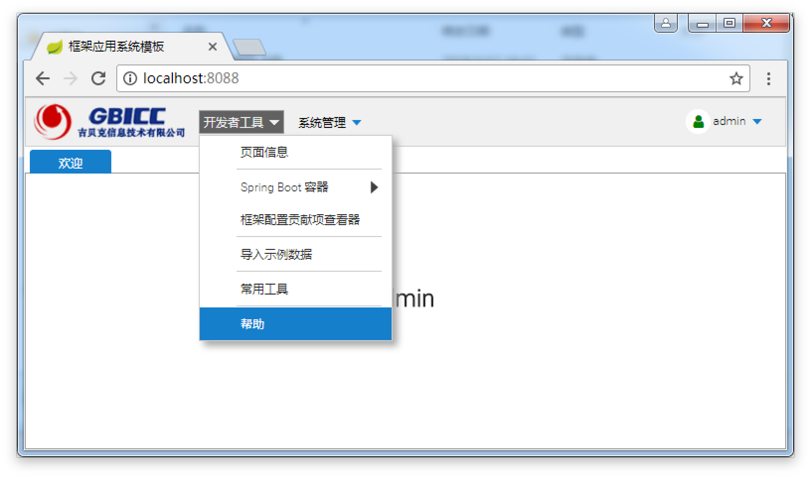
